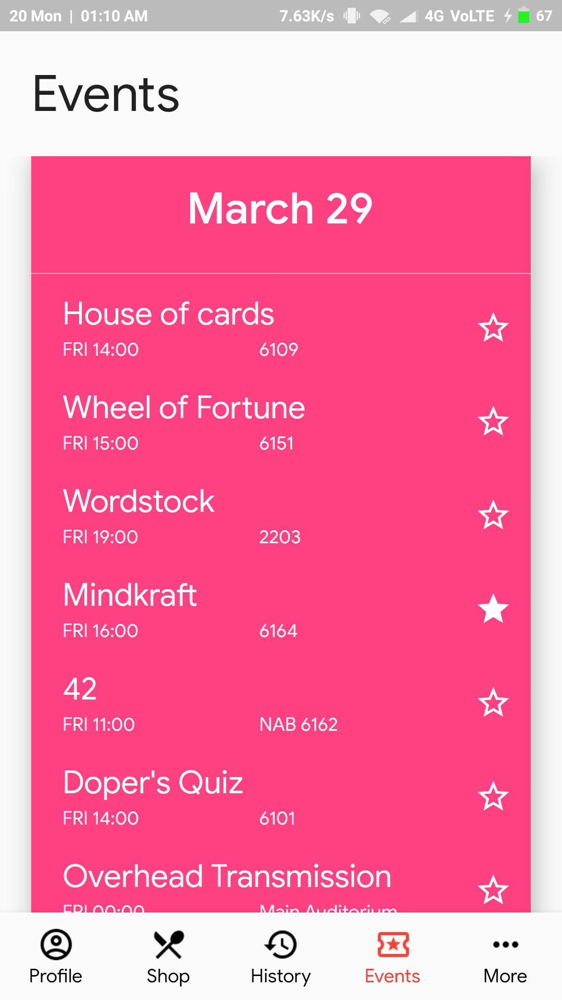
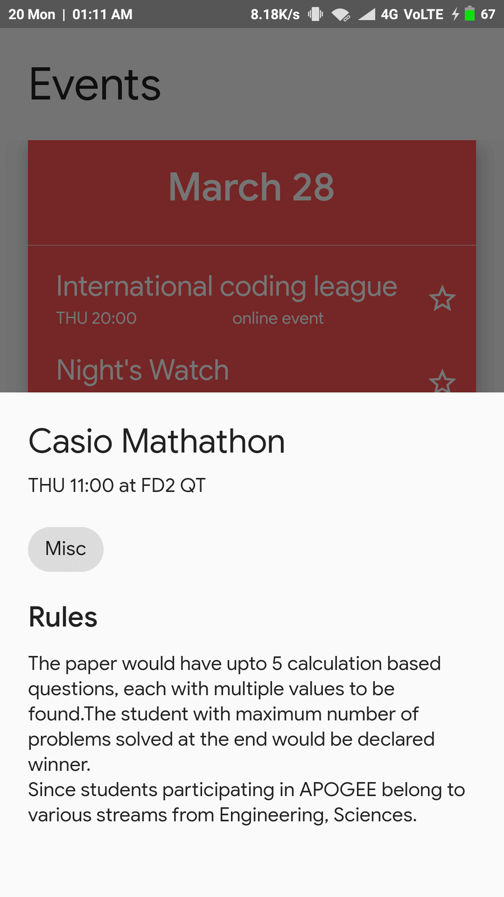
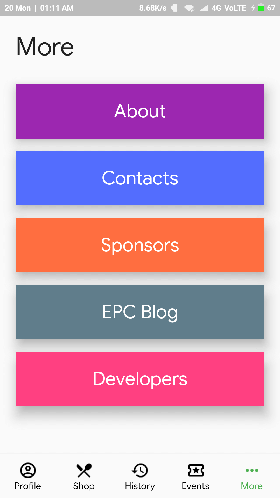
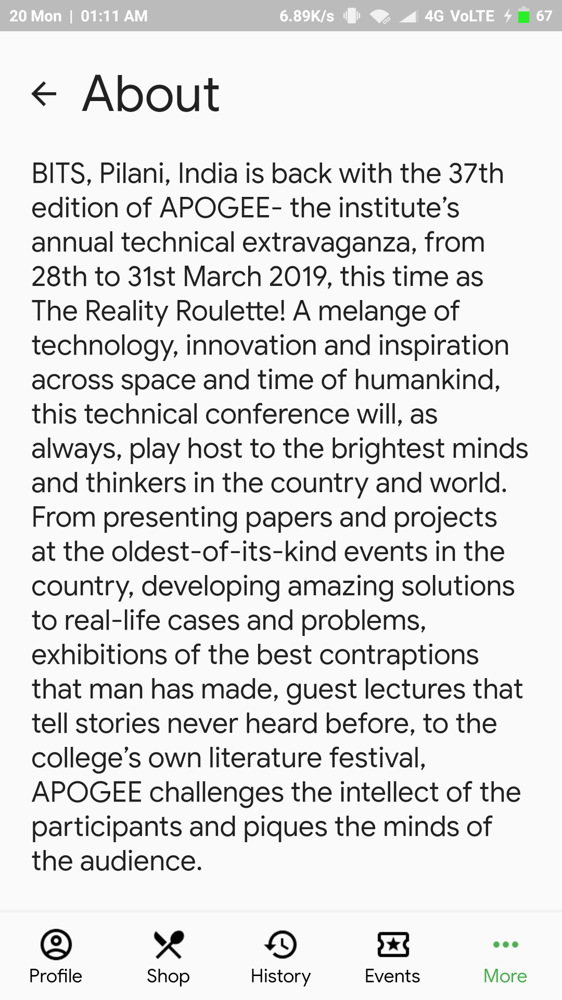
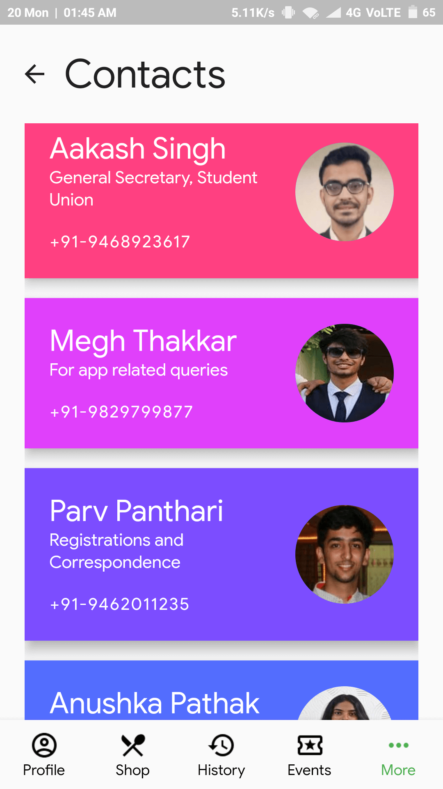
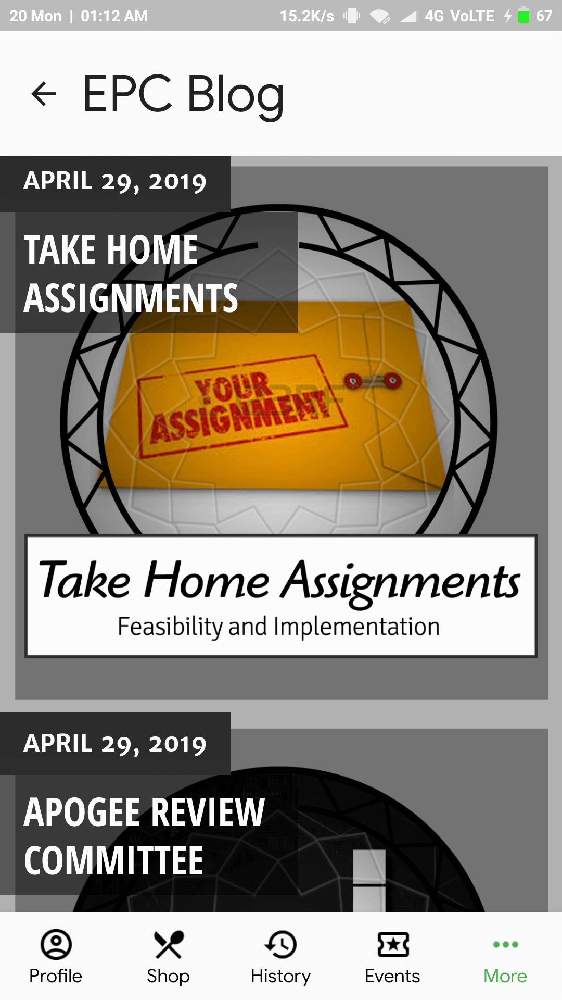
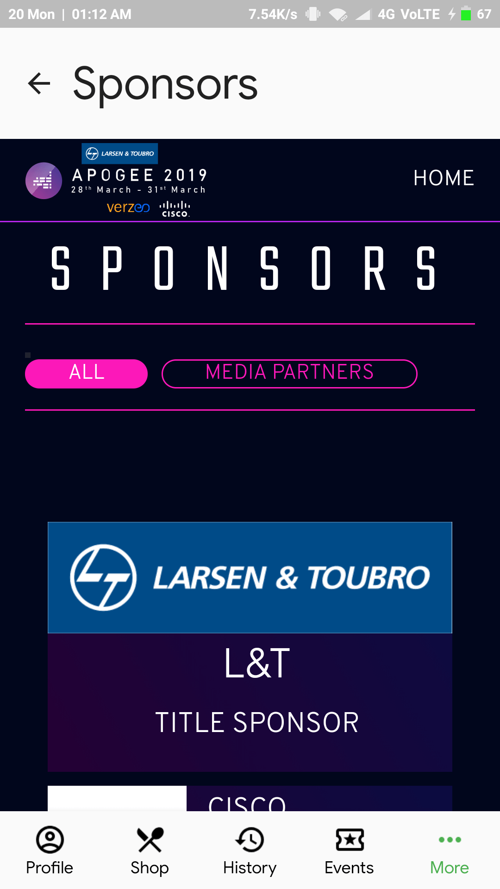
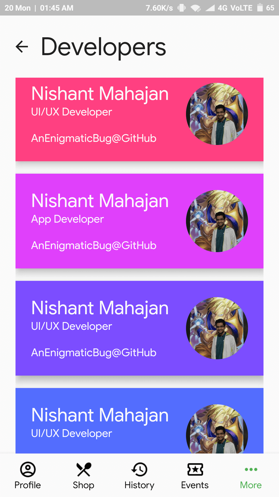

# Fest App

This app is modelled after my college's existing fest apps. The main purpose of this project is to explore Flutter in a fun way and to see what all areas may pose difficulties when making a production app in Flutter.

## UI/UX Design

This app's UI has been done by me. Most of the time, it was just me playing around with widgets and finding a decent looking result. So, the UI is pretty much serendipitous.

The UX is somewhat inspired by the APOGEE'19 android app.

## Screenshots

 

 

 

 

## Goals

* Feature parity with the APOGEE'19 android app
* Consistent 60 FPS
* Delightful UI and animations
* A good and maintainable code-base
* Unit and Widget tests
* Running on iOS

## Data Sources

The app currently takes in the events data from the APOGEE 2019 backend. Contacts are copied from the APOGEE'19 android app. Sponsors are shown using a webview pointing to the APOGEE 2019 website. The developers data has been crafted by me ;)

Since I don't control the backend or the website, the app may break at some point in future.

## Note

This project is very much a WIP. A lot of functionality(mostly the wallet part) is missing and the existing code may be further improved. Look out for frequent updates to this project.
